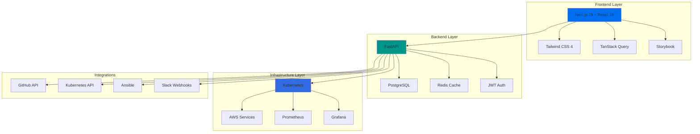

<div align="center">

# 🚀 OpsSight DevOps Visibility Platform

**Enterprise-grade DevOps monitoring and visibility platform with real-time insights, advanced theming, and comprehensive infrastructure monitoring.**

[](https://github.com/pavan-official/Devops-app-dev-cursor/actions/workflows/enhanced-ci-cd.yml)
[](https://github.com/pavan-official/Devops-app-dev-cursor/actions/workflows/security-scan.yml)
[](https://codecov.io/gh/pavan-official/Devops-app-dev-cursor)
[](https://opensource.org/licenses/MIT)
[](http://makeapullrequest.com)

[](https://nextjs.org/)
[](https://reactjs.org/)
[](https://www.typescriptlang.org/)
[](https://fastapi.tiangolo.com/)
[](https://www.docker.com/)
[](https://kubernetes.io/)

[⭐ Star us on GitHub](https://github.com/pavan-official/Devops-app-dev-cursor) • [📖 Documentation](docs/) • [🐛 Report Bug](https://github.com/pavan-official/Devops-app-dev-cursor/issues) • [💡 Request Feature](https://github.com/pavan-official/Devops-app-dev-cursor/issues) • [💬 Discord](https://discord.gg/opssight)

</div>

---

## 📋 Table of Contents

- [Overview](#-overview)
- [Key Features](#-key-features)
- [Architecture](#-architecture)
- [Quick Start](#-quick-start)
- [Demo](#-demo)
- [Documentation](#-documentation)
- [Contributing](#-contributing)
- [Security](#-security)
- [License](#-license)

## 🎯 Overview

**OpsSight** is a comprehensive DevOps visibility platform that provides real-time insights into CI/CD pipelines, infrastructure health, and development workflows. Built with modern technologies and best practices, OpsSight combines powerful monitoring capabilities with an advanced, accessible theme system to create a unified dashboard experience for DevOps teams.

### Why OpsSight?

- 🔍 **Unified Visibility** - Single pane of glass for all your DevOps metrics
- ⚡ **Real-time Monitoring** - Live updates from CI/CD pipelines and infrastructure
- 🎨 **Advanced Theming** - 7 theme variants with WCAG 2.1 AA accessibility compliance
- 🚀 **Production Ready** - Enterprise-grade architecture with Kubernetes support
- 🔒 **Security First** - Built with security best practices and compliance in mind
- 📱 **Fully Responsive** - Mobile-first design that works everywhere
- 🧩 **Extensible** - Plugin architecture for custom integrations

## ✨ Key Features

### 🔐 Core Platform Capabilities

| Feature | Description |
|---------|-------------|
| **🔐 GitHub OAuth** | Secure authentication with GitHub integration |
| **📊 Real-time Monitoring** | Live metrics from CI/CD pipelines and infrastructure |
| **☸️ Kubernetes Monitoring** | Comprehensive cluster health and resource tracking |
| **🤖 Ansible Tracking** | Monitor automation coverage and execution |
| **📈 Performance Analytics** | Detailed insights into system performance and trends |
| **🔔 Alert Integration** | Slack and webhook notifications for critical events |

### 🎨 Advanced Theme System

- **7 Theme Variants**: Minimal, neo-brutalist, glassmorphic, cyberpunk, editorial, accessible, dynamic
- **4 Color Modes**: Light, dark, high-contrast, and system preference
- **Contextual Themes**: Default, focus, relax, and energize modes for different workflows
- **WCAG 2.1 AA Compliant**: Full accessibility support with screen reader compatibility
- **Performance Optimized**: Smooth transitions and efficient rendering
- **Persistent Preferences**: User settings saved across sessions

### 🛠️ Developer Experience

- **📚 Comprehensive Documentation**: Storybook integration with interactive component docs
- **🧪 Extensive Testing**: Unit, integration, and accessibility testing with >80% coverage
- **🔧 TypeScript Support**: Full type safety with comprehensive TSDoc comments
- **🎨 Design System**: Consistent design tokens and reusable components
- **🔄 Hot Reload**: Fast development with instant feedback

## 🏗️ Architecture

### System Architecture



### Technology Stack

#### Frontend
- **Framework**: Next.js 15 with React 19 and TypeScript 5
- **Styling**: Tailwind CSS 4 with design tokens
- **State Management**: React Context + TanStack Query
- **Testing**: Jest + React Testing Library + Vitest + Playwright
- **Documentation**: Storybook 9 with accessibility addon
- **Build Tool**: Vite with Turbopack

#### Backend
- **Framework**: FastAPI (Python 3.11+)
- **Database**: PostgreSQL with asyncpg
- **Cache**: Redis
- **Authentication**: GitHub OAuth + JWT
- **API Integration**: GitHub API, Kubernetes API, Ansible
- **Containerization**: Docker + Docker Compose

#### Infrastructure
- **Cloud Provider**: AWS
- **Container Orchestration**: Kubernetes (EKS)
- **Monitoring**: Prometheus + Grafana + AlertManager
- **CI/CD**: GitHub Actions
- **Infrastructure as Code**: Terraform
- **Helm Charts**: Production-ready Helm charts included

## 🚀 Quick Start

### Prerequisites

- Node.js 18+ and npm 8+
- Docker and Docker Compose
- Python 3.11+ (for backend development)
- Git

### Installation

1. **Clone the repository:**
   ```bash
   git clone https://github.com/pavan-official/Devops-app-dev-cursor.git
   cd Devops-app-dev-cursor
   ```

2. **Set up environment variables:**
   ```bash
   # Copy environment templates
   cp .env.example .env
   cp frontend/.env.local.example frontend/.env.local
   
   # Configure your GitHub OAuth app credentials
   # See docs/getting-started/setup-guide.md for detailed instructions
   ```

3. **Start with Docker Compose (Recommended):**
   ```bash
   docker-compose up -d
   ```

4. **Or run locally:**
   ```bash
   # Install dependencies
   npm install
   npm run setup
   
   # Start frontend development server
   cd frontend && npm run dev
   
   # In another terminal, start backend
   cd backend
   pip install -r requirements.txt
   uvicorn app.main:app --reload
   ```

5. **Access the application:**
   - **🎯 Main Application**: [http://localhost:3000](http://localhost:3000)
   - **📚 Component Library**: [http://localhost:6006](http://localhost:6006) - Storybook
   - **🛠️ API Documentation**: [http://localhost:8000/docs](http://localhost:8000/docs) - FastAPI Swagger
   - **📊 Monitoring**: [http://localhost:3001](http://localhost:3001) - Grafana (admin/admin)

### Quick Demo

Launch the complete demo environment with realistic mock data:

```bash
# Full demo with mock data (recommended)
./scripts/demo-setup.sh

# Or quick start with Docker only
./scripts/quick-demo.sh
```

📖 **[Full Demo Guide](docs/demo-environment-guide.md)** - Complete testing scenarios and URLs

## 📁 Project Structure

```
opsight-devops-platform/
├── frontend/                    # Next.js React application
│   ├── src/
│   │   ├── components/         # Reusable UI components
│   │   │   ├── ui/            # Core UI components
│   │   │   ├── auth/          # Authentication components
│   │   │   ├── dashboard/     # Dashboard-specific components
│   │   │   └── charts/        # Data visualization components
│   │   ├── pages/             # Next.js pages
│   │   ├── hooks/             # Custom React hooks
│   │   ├── contexts/          # React contexts (Auth, Theme, Settings)
│   │   ├── utils/             # Helper functions and utilities
│   │   ├── types/             # TypeScript type definitions
│   │   └── styles/            # Global styles and theme tokens
│   ├── stories/               # Storybook stories
│   └── tests/                 # Test files
├── backend/                    # FastAPI Python application
│   ├── app/
│   │   ├── api/               # API routes and endpoints
│   │   ├── core/              # Core configuration and settings
│   │   ├── models/            # Database models
│   │   ├── services/          # Business logic and external integrations
│   │   └── tests/             # Backend test files
│   └── requirements.txt       # Python dependencies
├── api-module/                 # Shared API client module
├── infrastructure/            # Terraform and deployment configs
├── k8s/                       # Kubernetes manifests
├── helm/                      # Helm charts
├── monitoring/                # Prometheus, Grafana configurations
├── docs/                      # Additional documentation
├── scripts/                   # Utility scripts
└── docker-compose.yml         # Local development environment
```

## 🧪 Development

### Available Scripts

#### Frontend
```bash
cd frontend

# Development
npm run dev              # Start development server
npm run build           # Build for production
npm run start           # Start production server

# Testing
npm run test            # Run Jest tests
npm run test:watch      # Run tests in watch mode
npm run test:coverage   # Generate coverage report
npm run test:e2e        # Run Playwright E2E tests

# Code Quality
npm run lint            # Run ESLint
npm run lint:fix        # Fix ESLint issues
npm run format          # Format with Prettier
npm run type-check      # TypeScript type checking
npm run validate        # Run all quality checks

# Documentation
npm run storybook       # Start Storybook
npm run build-storybook # Build Storybook
```

#### Backend
```bash
cd backend

# Development
uvicorn app.main:app --reload    # Start development server
python -m pytest                # Run tests
python -m pytest --cov          # Run tests with coverage

# Code Quality
black .                          # Format code
isort .                          # Sort imports
flake8 .                        # Lint code
mypy .                          # Type checking
```

### Testing Strategy

- **Unit Tests**: Jest + React Testing Library for components
- **Integration Tests**: API endpoint testing with FastAPI TestClient
- **E2E Tests**: Playwright for end-to-end testing
- **Accessibility Tests**: Automated a11y testing with axe-core
- **Visual Tests**: Storybook visual regression testing
- **Performance Tests**: Lighthouse CI for performance monitoring

### Code Quality

- **TypeScript**: Full type safety with strict mode enabled
- **ESLint**: Comprehensive linting with React and accessibility rules
- **Prettier**: Consistent code formatting
- **Husky**: Pre-commit hooks for quality gates
- **TSDoc**: Comprehensive documentation for all TypeScript code

## 📚 Documentation

- **[Setup Guide](docs/getting-started/setup-guide.md)** - Detailed setup and configuration
- **[Architecture Guide](docs/architecture-guide.md)** - System architecture and design decisions
- **[API Documentation](docs/api-documentation.md)** - Complete API reference
- **[Theme System](docs/theme-system.md)** - Complete theme system documentation
- **[Testing Guide](docs/testing-and-validation.md)** - Testing strategies and best practices
- **[Deployment Guide](docs/deployment-guide.md)** - Production deployment instructions
- **[Monitoring Setup](docs/monitoring-setup.md)** - Infrastructure monitoring configuration
- **[Security Guide](SECURITY.md)** - Security policy and best practices
- **[Contributing Guide](CONTRIBUTING.md)** - How to contribute to the project

## 🤝 Contributing

We welcome contributions from the community! Whether you're fixing bugs, adding features, improving documentation, or helping with translations, your contributions make OpsSight better for everyone.

### Quick Start for Contributors

1. **⭐ Star the repository** to show your support
2. **🍴 Fork the repository** and clone your fork
3. **📖 Read our [Contributing Guide](CONTRIBUTING.md)** for detailed guidelines
4. **🏷️ Check [Good First Issues](https://github.com/pavan-official/Devops-app-dev-cursor/labels/good%20first%20issue)** for beginner-friendly tasks
5. **💬 Join our [Discord](https://discord.gg/opssight)** to discuss ideas and get help

### Ways to Contribute

- 🐛 **Report Bugs**: Use our [bug report template](.github/ISSUE_TEMPLATE/bug_report.yml)
- ✨ **Request Features**: Use our [feature request template](.github/ISSUE_TEMPLATE/feature_request.yml)
- 📝 **Improve Documentation**: Help make our docs even better
- 🧪 **Add Tests**: Increase test coverage and reliability
- 🌍 **Translations**: Help make OpsSight accessible globally
- 🎨 **UI/UX**: Improve the user experience and design

### Code Standards

- Follow TypeScript best practices with strict mode
- Write comprehensive tests (aim for >80% coverage)
- Ensure accessibility compliance (WCAG 2.1 AA)
- Document all public APIs with TSDoc comments
- Follow the established file structure and naming conventions
- Use [Conventional Commits](https://www.conventionalcommits.org/) for commit messages

## 🔒 Security

We take security seriously. Please review our [Security Policy](SECURITY.md) before reporting security vulnerabilities.

**⚠️ Please do not report security vulnerabilities through public GitHub issues.**

Instead, please report them via:
- **Email**: security@opssight.dev
- **GitHub Security Advisory**: [Create a security advisory](https://github.com/pavan-official/Devops-app-dev-cursor/security/advisories/new)

## 🏆 Contributors

Thanks to all our amazing contributors! 🎉

[](https://github.com/pavan-official/Devops-app-dev-cursor/graphs/contributors)

## 💬 Community & Support

### 🆘 Getting Help

- 📚 **Documentation**: Check our [comprehensive docs](docs/)
- 💬 **GitHub Discussions**: [Ask questions and share ideas](https://github.com/pavan-official/Devops-app-dev-cursor/discussions)
- 🐛 **Bug Reports**: [Report issues using our templates](https://github.com/pavan-official/Devops-app-dev-cursor/issues)
- 💬 **Discord**: [Join our community chat](https://discord.gg/opssight)
- 📧 **Email**: contact@opssight.dev

### 🌐 Community Channels

- **Discord**: Real-time chat and support
- **GitHub Discussions**: Longer-form discussions and Q&A
- **Twitter**: [@OpsSightDev](https://twitter.com/OpsSightDev) - Updates and announcements
- **LinkedIn**: [OpsSight Platform](https://linkedin.com/company/opssight) - Professional updates

### 🔔 Stay Updated

- ⭐ **Star this repository** to get notifications
- 👀 **Watch releases** for new version notifications
- 📧 **Subscribe to our newsletter** at [opssight.dev/newsletter](https://opssight.dev/newsletter)
- 🐦 **Follow us on Twitter** [@OpsSightDev](https://twitter.com/OpsSightDev)

## 📊 Project Stats


## ⭐ Star History

[](https://star-history.com/#pavan-official/Devops-app-dev-cursor&Date)

## 🔗 Related Projects

Check out these related projects in the DevOps ecosystem:

- **[Backstage](https://backstage.io/)** - Open platform for building developer portals
- **[Grafana](https://grafana.com/)** - Open source analytics & monitoring solution
- **[Prometheus](https://prometheus.io/)** - Monitoring system & time series database
- **[ArgoCD](https://argoproj.github.io/cd/)** - Declarative GitOps continuous delivery tool
- **[Tekton](https://tekton.dev/)** - Cloud native solution for building CI/CD systems

## 📄 License

This project is licensed under the MIT License - see the [LICENSE](LICENSE) file for details.

```
MIT License

Copyright (c) 2025 OpsSight DevOps Platform

Permission is hereby granted, free of charge, to any person obtaining a copy
of this software and associated documentation files (the "Software"), to deal
in the Software without restriction, including without limitation the rights
to use, copy, modify, merge, publish, distribute, sublicense, and/or sell
copies of the Software, and to permit persons to whom the Software is
furnished to do so, subject to the following conditions:

The above copyright notice and this permission notice shall be included in all
copies or substantial portions of the Software.
```

## 🙏 Acknowledgments

We extend our gratitude to the amazing open-source community and the following projects that make OpsSight possible:

### 🏗️ Core Technologies
- **[Next.js](https://nextjs.org/)** - The React framework for production
- **[React](https://reactjs.org/)** - A JavaScript library for building user interfaces
- **[TypeScript](https://www.typescriptlang.org/)** - Typed JavaScript at any scale
- **[FastAPI](https://fastapi.tiangolo.com/)** - Modern, fast web framework for Python
- **[PostgreSQL](https://www.postgresql.org/)** - Advanced open source database
- **[Redis](https://redis.io/)** - In-memory data structure store

### 🎨 UI & Design
- **[Tailwind CSS](https://tailwindcss.com/)** - Utility-first CSS framework
- **[Headless UI](https://headlessui.dev/)** - Unstyled, accessible UI components
- **[Heroicons](https://heroicons.com/)** - Beautiful hand-crafted SVG icons
- **[Lucide React](https://lucide.dev/)** - Beautiful & consistent icon toolkit
- **[Recharts](https://recharts.org/)** - Redefined chart library built with React

### 🧪 Testing & Quality
- **[Jest](https://jestjs.io/)** - Delightful JavaScript testing framework
- **[React Testing Library](https://testing-library.com/)** - Testing utilities for React
- **[Playwright](https://playwright.dev/)** - End-to-end testing framework
- **[ESLint](https://eslint.org/)** - Find and fix problems in JavaScript code
- **[Prettier](https://prettier.io/)** - Opinionated code formatter

### 🔧 DevOps & Infrastructure
- **[Docker](https://www.docker.com/)** - Containerization platform
- **[Kubernetes](https://kubernetes.io/)** - Container orchestration system
- **[Prometheus](https://prometheus.io/)** - Monitoring system & time series database
- **[Grafana](https://grafana.com/)** - Open observability platform
- **[GitHub Actions](https://github.com/features/actions)** - CI/CD platform

### 🌟 Special Thanks
- **Contributors**: All the amazing people who contribute code, documentation, and ideas
- **Community**: Our Discord community for feedback and support
- **Beta Testers**: Early adopters who help us improve the platform
- **Open Source**: The entire open-source ecosystem that makes projects like this possible

---

<div align="center">

### 🚀 Ready to get started?

[**📖 Read the Docs**](docs/) • [**🎮 Try the Demo**](http://localhost:3000) • [**💬 Join Discord**](https://discord.gg/opssight) • [**🐦 Follow on Twitter**](https://twitter.com/OpsSightDev)

**Made with ❤️ by the OpsSight team and contributors**

⭐ **Star us on GitHub** — it motivates us a lot!

</div>
